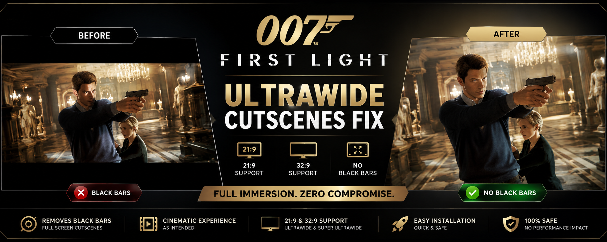

# 007-FirstLight-Ultrawide-Cutscenes-Fix
Ultrawide cutscenes fix for 007 First Light. Removes black bars, letterbox and side bars for 21:9 and 32:9 displays.
<h1 align="center">007 FirstLight Ultrawide Cutscenes Fix</h1>

Remove Black Bars • Full 21:9 Support • Full 32:9 Support

<a href="../../releases">⬇ Download Latest Release</a>

  

<h1 align="center">007 FirstLight Ultrawide Cutscenes Fix</h1>

  🎬 Full Cutscene Support • 🖥️ 21:9 & 32:9 • 🚫 No Black Bars

  

---

## Experience 007 First Light The Way It Should Be

Playing on an ultrawide monitor but still getting black bars during cutscenes?

This fix removes cinematic letterboxing and restores the full image area for modern displays, delivering a truly immersive experience.

---

## Why Use This Fix?

<table>
<tr>
<td width="50%">

### ❌ Default Game

- Black bars during cutscenes
- Reduced image area
- Broken ultrawide presentation
- Less immersion

</td>

<td width="50%">

### ✅ With This Fix

- Full-screen cutscenes
- Native ultrawide experience
- Better immersion
- No performance impact

</td>
</tr>
</table>

---

## Features

🟢 Removes black bars

🟢 Removes letterboxing

🟢 Full 21:9 support

🟢 Full 32:9 support

🟢 Supports 3440x1440

🟢 Supports 5120x1440

🟢 Lightweight

🟢 Easy installation

---

## Supported Displays

| Aspect Ratio | Support |
|-------------|----------|
| 21:9 | ✅ |
| 32:9 | ✅ |
| 16:9 | ✅ |

---

## Installation

### Method 1

1. Download latest release
2. Extract ZIP
3. Run installer
4. Launch game

### Method 2

1. Download latest release
2. Copy files manually
3. Launch game

---

## Downloads

📥 Download the latest release from the Releases page.

---

## Screenshots

### Before

### After

---

## FAQ

### Is this safe?

Yes.

### Does it affect performance?

No.

### Will it work with future updates?

Future game updates may require a new version.

---

## SEO Keywords

007 First Light Ultrawide Fix

007 First Light Black Bars Fix

007 First Light Letterbox Removal

007 First Light 21:9 Fix

007 First Light 32:9 Fix

007 First Light Ultrawide Support

007 First Light Cutscene Fix

007 First Light Widescreen Fix

007 First Light PC Mod

007 First Light Steam Mod
